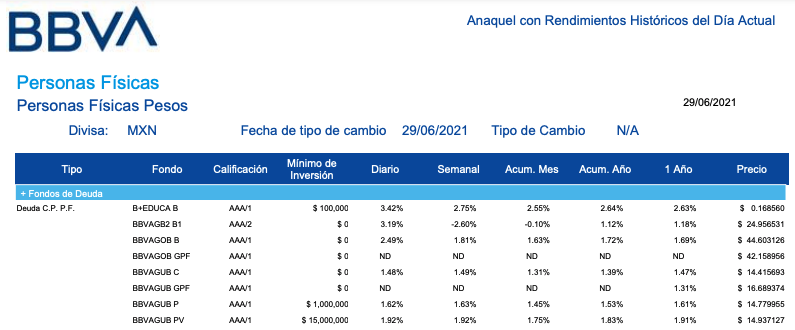
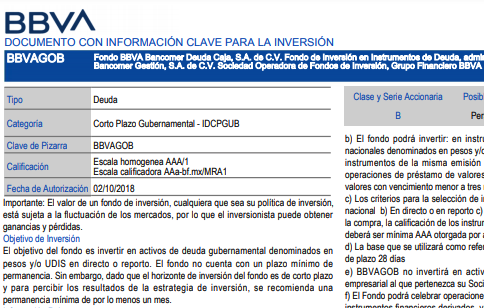

```{r setup, include=FALSE}
knitr::opts_chunk$set(echo = TRUE)
library(DT)
library(kableExtra)
```
# Introducción

Esta pagina tiene como proposito mostrar las bases de datos, metodología, proceso de pensamiento y explicar el uso de los scripts utilizados. Si el interés es mejor explorar el desarrollo de los scripts se recomienda abrirlos directamente con un editor de texto pues vienen comentados.


# Reto

Los clientes de Infosel necesitan acceder a la información de los Fondos de Inversión de BBVA Bancomer Gestión S.A de C.V, Sociedad Operadora de Fondos de Inversión. Para eso, la información solicitada por los clientes se puede localizar en:
- El prospecto de colocación del fondo
- Información de Mercado del fondo
- Información de las carteras de inversión de los fondos

Por favor proporcione los datos de una muestra de cinco fondos de la operadora de fondos de BBVA con sus correspondientes series. La información solcitiada deberá corresponder a la más actual en los documentos y fuentes oficiales de información.


# Metodología

## Investigación inicial

En primer lugar se optó por investigar las paginas mencionadas en la descripción del reto así como de la Sociedad Operadora:

+ BMV
+ Valmer
+ BBVA

Sin embargo se notó que solo se encontraba información muy general. Por lo que se decidió hacer una busqueda más especifica dentro de la pagina de la Sociedad Operadora.

## Definición de estrategia

Se encontró que la SO pública informes y reportes relacionados con el desempeño, normatividad y demás información relevante para el inversionista de cada bono y de los bonos de la SO en general. Por ello, con base en dichos documentos se decidió optar por dos estrategias con base en dos documentos distintos.

+ En primer lugar, una extracción de datos general del reporte diario acerca de todos los fondo de la [Sociedad Operadora](https://portal.bbva.mx/siabinternet/Repositorio/import/doctos/analisis/00003776.pdf).



+ En segundo lugar, una vez identificado algún bono en particular, se procede a realizar una extracción direccionada con base en el documento DICI que emite la SO para cada fondo.



Para estas tareas se desarrollaron 2 scripts de bash para la extracción y limpieza inicial y 2 de R para acomodar los datos. Los 4 scripts son automaticos, replicables y altamente funcionales. 

Como comentario final, algunas variables no se extrajeron debido a que implicaría hacer 2 códigos adicionales para cada tipo de docuemnto nuevo. De esta manera, debido al tiempo otorgado (y debido a que tengo actividades) se decidió eficientizar esfuerzos en los dos tipos de documentos más ricos en contenido.


# Mining general

## Requisitos

Para la replicabilidad del mining  se necesitan las siguientes cosas:

+ contar con la url del reporte diario de la SO "Anaquel con Rendimientos Históricos del Día Actual". El cuál es el mismo url dia con día. (https://portal.bbva.mx/siabinternet/Repositorio/import/doctos/analisis/00003776.pdf)
+ contar con calibre instalado para extraer texto de pdfs
+ contar con R instalado(y los paquetes dplyr y readr)

Todo esto se pude poner en un contenedor de docker para asegurar la replicabilidad o bien instalarse de manera local, dependiendo el expertise y comodidad del usuario.


## Extracción de datos 

El siguiente scrpt en bash extrae el contenido en texto del pdf

```{bash, engine.opts='-l'}
chmod +x general_extraction.zh
./general_extraction.zh
```


## Limpieza

El siguiente script, acomoda la información extraída de tal manera que crea la base de datos de nombre *general_funds_info.csv*
```{r}
source("general_cleaning.R")
datatable(data, options = list(scrollX = TRUE))
```

## Conclusión

De esta manera obtuvimos una base de datos que se actualiza al día con la más reciente información proporcionada por BBVA.
# Mining direccionado

## Requisitos

Para la replicabilidad del mining se necesitan las siguientes cosas:

+ contar con las url de los reportes DICI de cada fondo de los que se tenga interes (puede ser 1, 5 o 1000, no importa, el código es muy funcional). Estos se optienen de buscar el nombre del fondo en la pagina de BBVA, una vez ahí, vamos a documentación y encontraremos la URL del documento de interés
+ contar con calibre instalado
+ contar con R instalado (y los paquetes dplyr y readr)

Todo esto se pude poner en un contenedor de docker para asegurar la replicabilidad o bien instalarse de manera local, dependiendo el expertise y comodidad del usuario.

## Extracción de datos 

El siguiente script extrae de cada documento DICI información de manera muy direccionada

```{bash, engine.opts='-l'}
chmod +x particular_extraction.zh
./particular_extraction.zh
```


## Limpieza

El siguiente script, acomoda la información extraída de tal manera que crea la base de datos de nombre *particular_funds_info.csv*
```{r}
#indico cuantos documentos scrapee
num<-10
source("particular_cleaning.R")
datatable(data, options = list(scrollX = TRUE))
```

## Conclusión

De esta manera obtuvimos un pipe automatico al que podemos dar de input las urls de los distintos fondos de la SO y el pipe extraerá, limpiará y ordenará la información.

# Conclusiones
+  Se uso la técnica de pdf scrapping para la extracción y se limpio la información en R
+ Se crearon scripts con pipes utiles y funcionales listos para usarse.
+ Se desarrollo la capacidad de extraer información general de manera diaria, puesto que se detecto que BBVA no cambia sus urls sino que solo los actualiza.
+ Se logró extraer, limpiar y presentar información de manera óptima ( en términos de tiempo, esfuerzo y contenido),

# Mejoras

+ Elaborar los scripts adicionales para las pocas variables que faltaron): se listan a continuación 

```{r}
x<-c(
"Página electrónica",
"Monto máximo de inversión",
"Horizonte de inversión",
"Nombre del director general de la Sociedad Operadora",
"Precio anterior",
"Variación",
"Variación %",
"Volumen total",
"Importe",
"ISIN",
"Fecha anterior",
"Comisiones"
)
```

+ Mejorar los scripts de tal manera que en cada iteración sean más generales y menos "casados" con la estructura de los documentos. Esto debido a que cambian, por ejemplo se encontró que BBVA tenía una columna menos en su información general en 2017.

+ Entablar comunicación con el usuario de los scripts de tal manera de proponerle una manera comoda para usar los scripts: por ejemplo, una app, un dashboard, un documento interactivo o el script, dependiendo. Esto debido a que en el caso de la información particular hay algunos  inputs como urls a scrapear e indicar cantidad de documentos. Por el contrario, los scripts de información general están listos para usarse de manera diaria sin ningun input, por lo menos hasta que BBVA cambie la url (en todo caso simplemente habría que actualizar la url).

+ Entablar comunicación con el usuario de tal manera de determinar la manera de uso para asegurar la replicanilidad. Puede montarse un docker, pueden instalarse requerimientos en cada maquina, puede montarse un servicio web o una maquina virtual.
